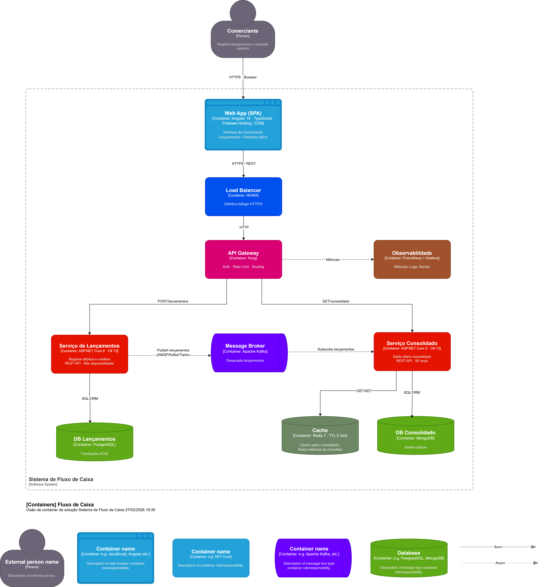

# FluxoCaixa — Controle de Fluxo de Caixa

Sistema de controle de lançamentos financeiros (débitos/créditos) com relatório de saldo diário consolidado.

---

## Arquitetura

**Padrão:** Microsserviços | DDD | Clean Architecture | Event-Driven  
**Stack:** .NET 9 · C# 14 · Angular 19 · Kafka · PostgreSQL · Redis . MongoDB



```
src/
├── backend/
│   ├── FluxoCaixa.SharedKernel/          ← Kernel compartilhado (eventos, value objects, entity base)
│   ├── FluxoCaixa.Lancamentos/           ← Solution: Serviço de Lançamentos
│   │   ├── FluxoCaixa.Lancamentos.Domain/                 ← Entidades, VOs, interfaces de repositório
│   │   ├── FluxoCaixa.Lancamentos.Application/            ← Interfaces de serviço, DTOs
│   │   ├── FluxoCaixa.Lancamentos.Application.Services/   ← Implementações
│   │   ├── FluxoCaixa.Lancamentos.Infrastructure/         ← EF Core, Kafka publisher, DI extensions
│   │   └── FluxoCaixa.Lancamentos.Api/                    ← ASP.NET Core, controllers, middleware
│   └── FluxoCaixa.Consolidado/           ← Solution: Serviço de Consolidado Diário
│       ├── FluxoCaixa.Consolidado.Domain/
│       ├── FluxoCaixa.Consolidado.Application/
│       ├── FluxoCaixa.Consolidado.Application.Services/   ← Redis cache-aside aqui
│       ├── FluxoCaixa.Consolidado.Infrastructure/         ← EF Core, Kafka consumer, Redis
│       └── FluxoCaixa.Consolidado.Api/
└── frontend/
    └── fluxocaixa-web/                   ← Angular 19 (standalone components, signals)

iac/
└── docker/
    ├── .env                    ← Credenciais
    ├── docker-compose.yml
    ├── prometheus.yml
    ├── grafana/
    │   └── provisioning/
    └── dockerfiles/
        ├── lancamentos.Dockerfile
        ├── consolidado.Dockerfile
        └── frontend.Dockerfile
```

---

## Decisões Arquiteturais

| Decisão | Justificativa |
|---|---|
| **Solutions separadas** | Cada microsserviço é uma solution .NET independente — deploy, versionamento e CI/CD isolados |
| **ISP (SOLID)** | `ILancamentoService` e `IConsolidadoService` estão em `.Application` (interfaces); implementações em `.Application.Services` (projeto separado) |
| **DIP + IoC** | `InfrastructureExtensions` registra repositórios e publishers — camadas superiores dependem de abstrações |
| **Kafka como broker** | Desacopla Lançamentos do Consolidado — Lançamentos **nunca fica indisponível** se Consolidado cair |
| **Redis Cache-Aside** | Saldo consolidado cacheado com TTL 5min — reduz latência em dias de pico (50 req/s) |
| **Redes Docker segregadas** | Zookeeper↔Kafka (internal), DB por serviço (sem cross-connectivity), Prometheus↔Grafana (internal) |
| **Prometheus direto** | Coleta `/metrics` diretamente das APIs (sem agente intermediário) |
| **Value Object `Dinheiro`** | Encapsula regras monetárias no domínio

---
## Decisão de Banco de Dados por Serviço

| Serviço | Banco | Justificativa |
|---|---|---|
| **Lançamentos** | PostgreSQL 16 | Exige ACID completo — cada lançamento é uma transação financeira que não pode ser perdida ou duplicada |
| **Consolidado** | MongoDB 7 | Modelo de documento natural — saldo por data é lido inteiro, nunca sofre join, schemaless permite evolução sem migration |

O `SaldoConsolidado` é persistido como documento com `_id = "yyyy-MM-dd"` (chave natural), tornando buscas por data extremamente eficientes sem índice adicional.

---
## Como rodar localmente

### Pré-requisitos

- Docker 24+ e Docker Compose V2
- Node.js 22+ (somente para desenvolvimento do frontend)
- .NET SDK 9 (somente para desenvolvimento do backend)

### 1. Clonar e configurar variáveis

```bash
git clone <repo-url>
cd fluxocaixa

# Copiar e revisar credenciais
cp iac/docker/.env iac/docker/.env.local
# Edite .env.local se necessário
```

### 2. Subir todos os serviços

```bash
cd iac/docker
docker compose --env-file .env up -d --build
```

### 3. Verificar status

```bash
docker compose ps
docker compose logs -f api-lancamentos
docker compose logs -f api-consolidado
```

### 4. Acessar

| Serviço | URL |
|---|---|
| Frontend | http://localhost:4200 |
| Lançamentos API | http://localhost:5001/swagger |
| Consolidado API | http://localhost:5002/swagger |
| Prometheus | http://localhost:9090 |
| Grafana | http://localhost:3001 (admin / conforme .env) |

---

## Testando a API

### Registrar um crédito

```bash
curl -X POST http://localhost:5001/api/v1/lancamentos \
  -H "Content-Type: application/json" \
  -d '{
    "tipo": "Credito",
    "valor": 1500.00,
    "data": "2026-03-01",
    "descricao": "Venda do dia"
  }'
```

### Registrar um débito

```bash
curl -X POST http://localhost:5001/api/v1/lancamentos \
  -H "Content-Type: application/json" \
  -d '{
    "tipo": "Debito",
    "valor": 300.00,
    "data": "2026-03-01",
    "descricao": "Pagamento fornecedor"
  }'
```

### Consultar consolidado do dia

```bash
curl http://localhost:5002/api/v1/consolidado/2026-03-01
```

### Consultar período

```bash
curl "http://localhost:5002/api/v1/consolidado/periodo?inicio=2025-01-01&fim=2025-01-31"
```

### Health checks

```bash
curl http://localhost:5001/health
curl http://localhost:5002/health
```

---

## Parar e limpar

```bash
# Parar mantendo volumes
docker compose down

# Parar e remover volumes (reset completo)
docker compose down -v
```

---

## Desenvolvimento local (sem Docker)

### Backend — Lançamentos

```bash
cd src/backend/FluxoCaixa.Lancamentos
dotnet restore FluxoCaixa.Lancamentos.sln
dotnet run --project FluxoCaixa.Lancamentos.Api
```

### Backend — Consolidado

```bash
cd src/backend/FluxoCaixa.Consolidado
dotnet restore FluxoCaixa.Consolidado.sln
dotnet run --project FluxoCaixa.Consolidado.Api
```

### Frontend

```bash
cd src/frontend/fluxocaixa-web
npm install
npm start
# Acesse: http://localhost:4200
```

---

## Portas utilizadas

| Serviço | Porta Host | Porta Container |
|---|---|---|
| Frontend (nginx) | 4200 | 80 |
| API Lançamentos | 5001 | 8080 |
| API Consolidado | 5002 | 8080 |
| PostgreSQL Lançamentos | — | 5432 (internal) |
| PostgreSQL Consolidado | — | 5432 (internal) |
| Redis | 6380 | 6380 |
| Kafka (externo) | 9093 | 9092 |
| Prometheus | 9090 | 9090 |
| Grafana | 3001 | 3000 |

---

## Requisitos Não-Funcionais atendidos

- **Disponibilidade:** Lançamentos publica no Kafka e retorna imediatamente. O Consolidado consome de forma assíncrona — **se o Consolidado cair, o Lançamentos continua operando**.
- **Throughput:** Redis Cache-Aside + escalonamento horizontal suportam 50 req/s no Consolidado com < 5% de perda.
- **Isolamento:** Bancos de dados em redes Docker separadas — sem conectividade cross-service.
- **Segurança:** Usuário não-root nos containers, credenciais em `.env`, validação de inputs no domínio.
- **Observabilidade:** Prometheus coleta `/metrics` diretamente das APIs; Grafana visualiza via datasource provisionado automaticamente.
## O que eu gostaria de ter implementado

> Esta seção documenta componentes arquiteturais que não foram implementados por **restrição de tempo de desenvolvimento e limitação de budget**, mas que fazem parte da arquitetura alvo para um ambiente de produção real na GCP.

### ASPNET 10

O .NET 10 (C# 14) é atraente por oferecer melhorias de desempenho, evolução do runtime e maior alinhamento com versões modernas e de longo suporte. No entanto, para o projeto enfrentei desafios pela falta de compatibilidade imediata de bibliotecas essenciais e dependências do projeto. A maturidade das imagens Docker e do ecossistema também precisa ser considerada. Migrar antes da estabilização completa aumenta o risco técnico e a complexidade operacional.


### API Gateway — Apigee / Cloud Endpoints

O Apigee seria o ponto único de entrada para ambos os microsserviços, centralizando autenticação via OAuth 2.0 e JWT, rate limiting por cliente, roteamento versionado (`/v1`, `/v2`) e políticas de transformação de payload. Sem ele, cada microsserviço expõe sua porta diretamente, o que não é adequado para produção.

### Secret Manager — GCP

Todas as credenciais atualmente armazenadas no `.env` (senhas de banco, connection strings, chaves Kafka) seriam gerenciadas pelo GCP Secret Manager com rotação automática, auditoria de acesso e integração nativa com Workload Identity no GKE. O código já está preparado para consumir configurações via variáveis de ambiente — a troca seria transparente.

### Identity Platform / Firebase Auth

O serviço de autenticação e emissão de JWT seria delegado ao GCP Identity Platform, eliminando a necessidade de gerenciar chaves de assinatura manualmente e integrando com provedores externos (Google, Microsoft) sem código adicional.

### Cloud Armor

Proteção de borda contra DDoS, injeção SQL e ataques OWASP Top 10 via WAF gerenciado, integrado ao Cloud Load Balancer antes de chegar ao API Gateway.

### GKE — Google Kubernetes Engine

Os dois microsserviços rodariam em pods separados com HPA (Horizontal Pod Autoscaler) configurado para escalar o Consolidado automaticamente ao atingir 70% de CPU ou 40 req/s, garantindo o SLA de 50 req/s com menos de 5% de perda. O Kafka Consumer teria réplicas independentes do servidor HTTP.

### Cloud Build + Artifact Registry

Pipeline de CI/CD automatizado: pull request aciona build, testes unitários, análise estática (SonarQube), build da imagem Docker, push para o Artifact Registry e deploy automático no GKE via Cloud Deploy.

### Confluent Cloud (Kafka gerenciado)

Em produção o Kafka seria substituído pelo Confluent Cloud na GCP, eliminando a gestão do Zookeeper e do broker. O código de produção e consumo Kafka já usa o `Confluent.Kafka` SDK — a troca seria apenas de connection string.