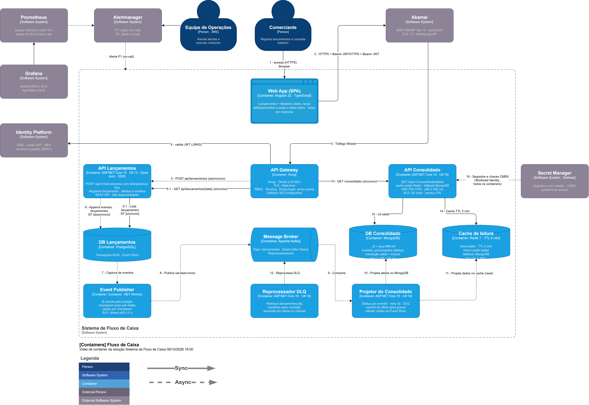
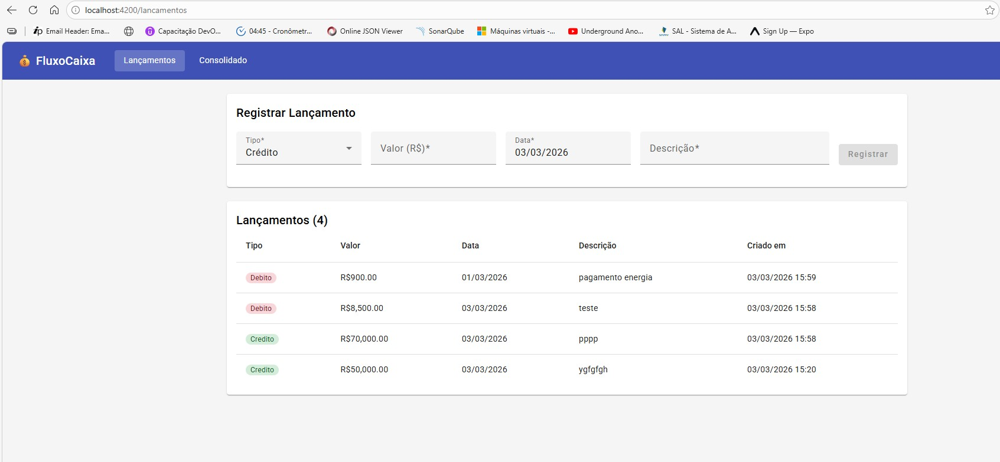
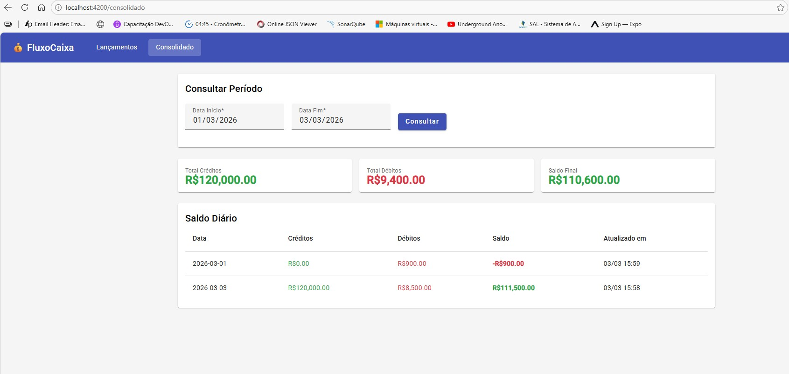
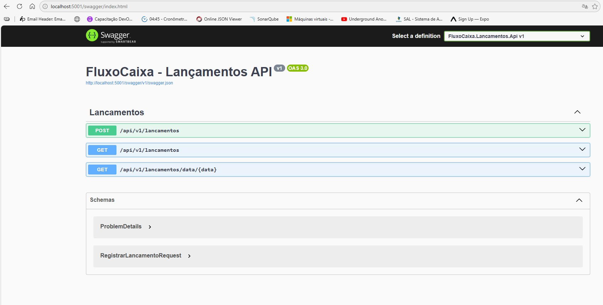
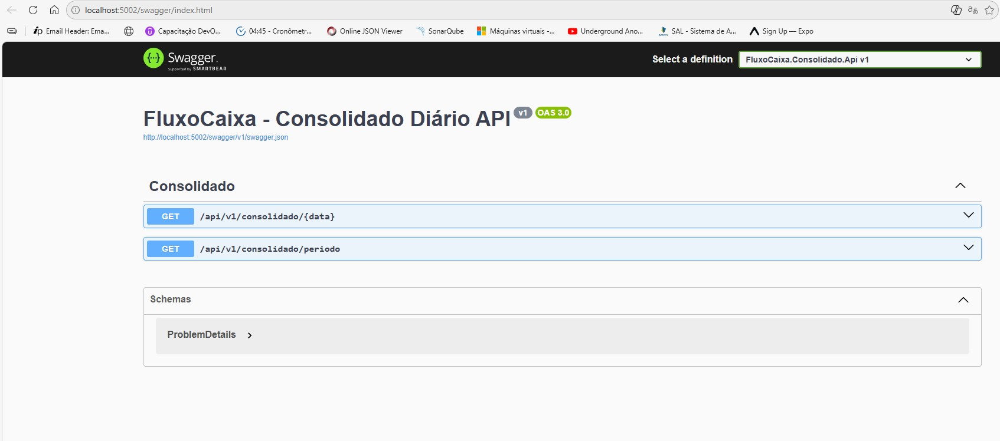
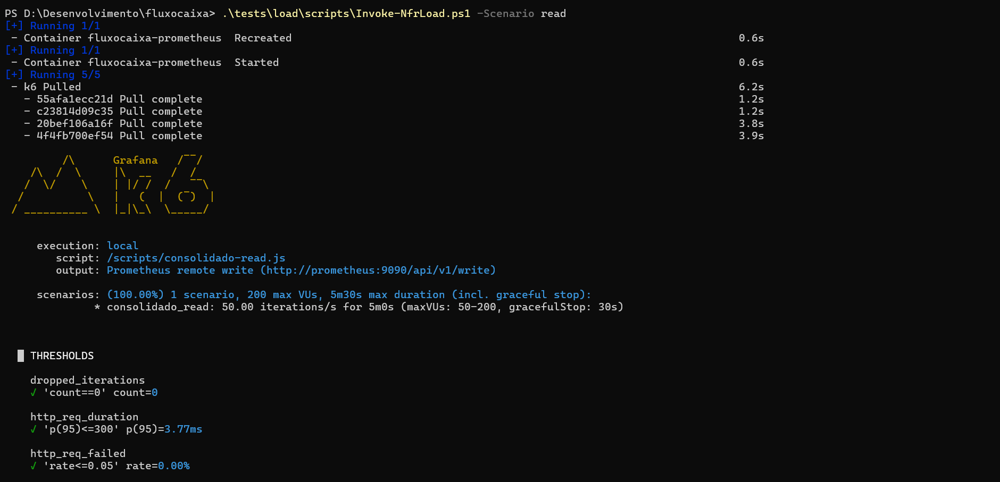
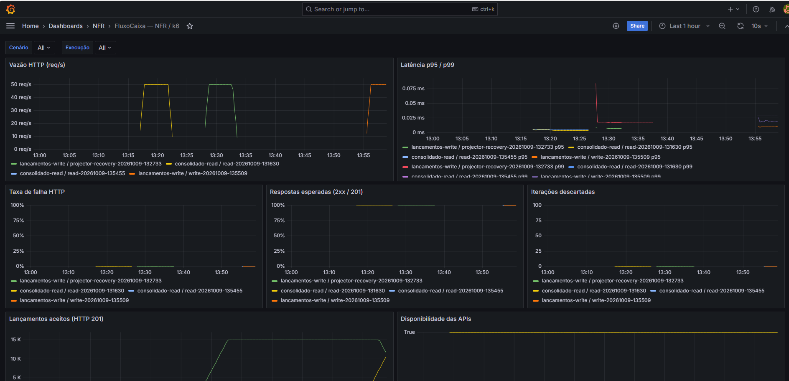

# FluxoCaixa — Arquitetura escalável para controle de fluxo de caixa

Este case trata do registro de créditos e débitos de um comerciante e da consulta do saldo diário consolidado. A solução foi construída para exercitar persistência financeira, processamento assíncrono e recuperação de eventos; o ambiente entregue é local, executado com Docker Compose.

## Contexto e requisitos

| Requisito do desafio | Como é tratado no case |
|---|---|
| Registrar créditos e débitos | API de Lançamentos persiste as operações no PostgreSQL |
| Consultar saldo diário | API de Consolidado lê a projeção MongoDB, com cache Redis |
| Sustentar 50 req/s e até 5% de falhas HTTP | Cenários k6 de leitura e escrita, por 5 minutos, com evidência exportada |
| Tolerar falha temporária do processamento assíncrono | Event Store/outbox, publisher, retries, DLQ e teste de retomada do Projetor |

O requisito de carga é um critério do desafio, não um SLO/SLA de produção. As medições registradas valem para a configuração local e para a janela do teste; não são garantia de capacidade em outro hardware, duração ou topologia.

## Arquitetura e limites do desenho

O desenho C4 abaixo é parte da proposta arquitetural deste case. Ele apresenta os containers e as integrações consideradas para a solução, inclusive a evolução desejada para identidade, proteção de borda e gestão de segredos. **Não significa que todos os elementos estejam implantados no Compose.** O estado executável é descrito logo após o desenho e seus limites estão registrados nos ADRs.



Fonte editável: [fluxoCaixa.drawio](./docs/arquitetura/fluxoCaixa.drawio).

**Implementado localmente:** frontend Angular 22; APIs Lançamentos e Consolidado em .NET 10; PostgreSQL; Kafka; Event Publisher; Projetor; MongoDB; Redis; worker de reprocessamento da DLQ; Prometheus, Grafana e cenários k6.

**Proposto no desenho, ainda não implantado:** Kong/API Gateway, Akamai, Identity Platform/OIDC, Delinea Secret Manager, Alertmanager/on-call e autoscaling. As portas são expostas localmente pelo Compose; não há caminho de tráfego ativo passando por gateway ou Akamai. No desenho, esses elementos expressam a direção arquitetural considerada, não serviços já contratados ou configurados.

O desenho considera uma evolução possível, mas o deployment local não entrega alta disponibilidade, identidade/IAM corporativa, rotação gerenciada de segredos ou operação 24x7. Não se afirma conformidade LGPD ou prontidão para produção.

## Decisões arquiteturais

As decisões abaixo ligam o requisito do case à escolha técnica e ao custo aceito.

| ADR | Requisito | Decisão e trade-off principal |
|---|---|---|
| ADR-01 | Não perder a associação entre lançamento aceito e evento a publicar | PostgreSQL grava lançamento e evento na mesma transação. O estado de escrita continua em `public.lancamentos`; `public.eventos` atua como Event Store/outbox. É uma escolha mais precisa que chamar o desenho de Event Sourcing integral. |
| ADR-02 | Isolar a escrita do atraso/falha de projeção | Event Publisher e Kafka separam gravação da atualização do saldo. A entrega é at-least-once e o consolidado é eventualmente consistente; o Compose usa broker único e fator de replicação 1. |
| ADR-03 | Otimizar a consulta diária | MongoDB mantém o read model por data e Redis aplica cache-aside com TTL de 5 min. A projeção pode ficar temporariamente atrasada ou em cache; consistência forte não é prometida. |
| ADR-04 | Tornar falhas recuperáveis e demonstráveis | Projetor usa retry, DLQ e deduplicação por `eventId`; há replay seletivo do Event Store e reprocessamento da DLQ. O rebuild integral do read model ainda não é automatizado. |
| ADR-05 | Executar e avaliar sem infraestrutura cloud | Docker Compose, Prometheus, Grafana e k6 tornam o case repetível localmente. A simplicidade reduz custo de entrada, mas não representa HA, IAM, backups gerenciados ou monitoramento operacional. |

## Arquitetura de software, padrões e tecnologias

A solução separa os fluxos de escrita e consulta para atender a necessidades diferentes: consistência transacional no registro e leitura consolidada de forma assíncrona. Os padrões abaixo foram escolhidos para esse problema e estão presentes no código; não são uma afirmação de que toda a arquitetura esteja pronta para produção.

| Escolha | Aplicação no FluxoCaixa | Por que se aplica e trade-off |
|---|---|---|
| Camadas com responsabilidades próximas a Clean Architecture | Projetos distintos para API, Application, Domain e Infrastructure; regras e interfaces ficam fora dos adaptadores de persistência e transporte | Facilita testar regras e substituir detalhes externos. Acrescenta projetos e mapeamentos; não se adotou uma camada por abstração sem necessidade. |
| DDD tático, de forma pragmática | `Lancamento` protege criação e valor monetário com `Dinheiro`; serviços de aplicação coordenam os casos de uso | Mantém validações financeiras junto ao domínio. O escopo não exige modelagem estratégica extensa nem um framework completo de DDD. |
| Separação de escrita e leitura (CQRS/read model) | API de Lançamentos grava no PostgreSQL; Projetor atualiza MongoDB e API de Consolidado consulta essa projeção | Otimiza o formato de consulta sem acoplar sua disponibilidade à gravação. Introduz consistência eventual e exige reconciliação/replay. |
| Outbox transacional e processamento orientado a eventos | Lançamento e evento são persistidos na mesma transação PostgreSQL; Event Publisher publica no Kafka e avança checkpoint após ACK | Evita a janela de perda entre confirmar a gravação e publicar. É Event Store/outbox, não Event Sourcing integral: `public.lancamentos` continua sendo o estado de escrita. |
| Idempotência, retry e DLQ | Chave de idempotência na API; Projetor deduplica por `eventId`, tenta novamente e encaminha falhas persistentes à DLQ | Reduz efeitos duplicados e permite isolar mensagens problemáticas. A entrega é at-least-once; operar DLQ e replay requer auditoria e ação técnica. |
| Cache-aside | API de Consolidado usa Redis com TTL de cinco minutos | Reduz leituras repetidas no read model; aceita que o valor em cache possa ficar temporariamente desatualizado. |

### Por que .NET 10, C# 14 e Angular 22

| Tecnologia | Fundamentação para este case e características relevantes |
|---|---|
| **.NET 10 / ASP.NET Core** | Base comum das APIs e dos workers .NET. O ecossistema oferece hospedagem de APIs e processos de background, injeção de dependência, configuração e logging integrados, além de suporte direto às bibliotecas usadas no case (EF Core, PostgreSQL e Kafka). O .NET 10 é uma versão LTS, favorecendo horizonte de manutenção; isso não substitui testes de carga, segurança ou operação. |
| **C# 14** | Versão de linguagem alinhada ao SDK/.NET 10. Tipagem estática, nullable reference types habilitado nos projetos e suporte a `async`/`await` ajudam a explicitar contratos e fluxos de I/O. A aplicação não depende de um recurso isolado do C# 14 como justificativa arquitetural; o ganho é usar uma linguagem atual e suportada sobre o runtime escolhido. |
| **Angular 22** | Aplicação de página única com componentes standalone, signals para estado local reativo, formulários reativos, roteamento e Angular Material. O TypeScript está em modo estrito, inclusive nos templates. Essa integração favorece uma estrutura explícita para telas e formulários do case; em contrapartida, tem mais convenções e estrutura inicial que opções menores. |

As versões foram escolhidas para alinhar ciclo de suporte, ferramentas e produtividade entre equipes, não por promessa de superioridade universal. Neste case, os diferenciais concretos são a integração do ecossistema .NET entre API e workers e, no frontend, o uso de componentes standalone, signals e verificação estrita de tipos/templates. O `TargetFramework` está em `net10.0`; os projetos não fixam `LangVersion`, portanto usam a versão padrão do compilador correspondente ao SDK instalado.

## Viabilidade financeira e transição

A execução atual é local, com Docker Compose. Para avaliar a viabilidade em produção, a estimativa abaixo simula uma implantação de referência em nuvem, sem afirmar que os serviços listados já estejam provisionados. Os valores são indicativos para planejamento inicial, não uma cotação nem um orçamento fechado.

### Premissas da simulação de produção

- **Provedor e região de referência:** Google Cloud, região de São Paulo (`southamerica-east1`) sempre que o serviço e a configuração escolhida estiverem disponíveis nessa região. Para componentes de terceiros, como MongoDB Atlas, a região equivalente deve ser confirmada na contratação.
- **Operação:** 730 horas/mês, com APIs e workers em containers gerenciados, banco e mensageria com redundância, backups, criptografia, controle de acesso e monitoramento.
- **Carga de referência:** requisito de teste de 50 req/s, com picos e margem operacional. O teste local não comprova que essa capacidade será mantida na nuvem; o dimensionamento definitivo depende de teste de carga no ambiente-alvo.
- **Câmbio de planejamento:** R$ 5,50 por US$ 1, utilizado apenas para converter as faixas. Impostos, suporte contratado, descontos, tráfego excepcional e variação cambial podem alterar o total.
- **Escopo:** inclui uma estimativa de serviços de aplicação e dos elementos produtivos ainda não implantados. Não inclui equipe de engenharia/operação, plantão humano, migração inicial nem contratos empresariais negociados individualmente.
- **Limite da estimativa:** os preços variam por região, capacidade, armazenamento, tráfego, retenção de logs e nível de disponibilidade. As faixas são uma ordem de grandeza para decisão arquitetural; devem ser refinadas na [calculadora oficial do Google Cloud](https://cloud.google.com/products/calculator) antes de qualquer compromisso financeiro.

### Estimativa mensal indicativa — GCP

| Componente | Simulação para produção na GCP | Estimativa mensal (US$) |
|---|---|---:|
| Execução das APIs e workers | Cloud Run para APIs, Event Publisher, Projetor e reprocessador, com limites de escala, health checks e instâncias mínimas conforme criticidade | 200–900 |
| PostgreSQL gerenciado | Cloud SQL for PostgreSQL, alta disponibilidade, armazenamento, backups e capacidade dimensionada | 400–1.200 |
| Kafka gerenciado | Google Cloud Managed Service for Apache Kafka, com cluster redundante, armazenamento e tráfego entre zonas; custo depende fortemente do throughput | 1.100–2.500 |
| MongoDB gerenciado | MongoDB Atlas em região GCP compatível, cluster replicado para o read model e recuperação | 250–900 |
| Redis gerenciado | Memorystore for Redis, com capacidade e nível de disponibilidade compatíveis com o cache | 100–450 |
| Gateway e balanceamento | API Gateway ou Apigee conforme a necessidade de políticas; Cloud Load Balancing e TLS. Kong pode ser mantido se for requisito explícito | 100–500 |
| Proteção de borda e CDN | Cloud Armor e Cloud CDN como alternativas nativas para funções de WAF/CDN atualmente atribuídas à Akamai | 100–700 |
| Identidade OIDC | Identity Platform ou provedor OIDC corporativo integrado ao gateway e às APIs; custo varia com usuários e métodos de autenticação | 0–400 |
| Gestão de segredos | Secret Manager, IAM, auditoria e processo de rotação. Uma solução Delinea pode ser mantida se houver requisito corporativo/licenciamento específico | 10–150 |
| Observabilidade e alertas | Cloud Monitoring, Cloud Logging, dashboards, métricas customizadas, alertas e integração com on-call | 200–1.200 |
| Rede, armazenamento, backups e transferência | VPC, conectividade privada, tráfego entre zonas, snapshots, retenção e saída de dados | 250–900 |
| Frontend estático | Cloud Storage e Cloud CDN ou serviço equivalente para distribuição do frontend | 20–120 |
| **Total de referência** | **Faixa preliminar para planejamento** | **2.730–9.920** |

Com o câmbio de planejamento acima, o total corresponde aproximadamente a **R$ 15 mil a R$ 54,6 mil por mês**. Para orçamento inicial, reservaria **R$ 18 mil a R$ 55 mil/mês**, até que testes de carga, retenção de logs, volume de dados, tráfego de saída, requisitos de disponibilidade e a calculadora de preços reduzam a incerteza.

O Kafka gerenciado é um dos principais direcionadores de custo: a própria documentação do Google apresenta, como referência, cerca de US$ 1,1 mil/mês para um cenário de cluster gerenciado com três réplicas e largura de banda de produtor de 10 MiB/s, usando preços de `us-central1`; isso não é uma cotação para São Paulo nem uma previsão direta para o tráfego deste case. A configuração real deve ser calculada para a região e throughput esperados. Consulte [preços do Managed Service for Apache Kafka](https://cloud.google.com/managed-service-for-apache-kafka/pricing?hl=pt-br). Os preços de Cloud Run, Cloud SQL, Cloud Armor e Secret Manager também dependem do uso e da configuração escolhida ([Cloud Run](https://cloud.google.com/run/pricing?hl=pt), [Cloud SQL](https://cloud.google.com/sql/pricing), [Cloud Armor](https://cloud.google.com/armor/pricing), [Secret Manager](https://cloud.google.com/secret-manager/pricing)).

A faixa é deliberadamente ampla: quantidade e tamanho das réplicas, retenção de observabilidade, volume de mensagens, transferência entre zonas e contratos empresariais são fatores relevantes. A estimativa para MongoDB considera MongoDB Atlas hospedado em GCP, pois o case usa MongoDB; substituí-lo por Firestore ou outro banco nativo exigiria uma decisão arquitetural e validação de compatibilidade, não apenas uma troca de preço. Da mesma forma, Cloud Armor/Cloud CDN e Secret Manager são alternativas para parte das funções de Akamai e Delinea, mas não significam equivalência integral de recursos ou de contratos.

### Serviços ainda não implementados: o que a simulação acrescenta

| Elemento proposto no C4 | Simulação na GCP | Objetivo e critério de aceite |
|---|---|---|
| Kong/API Gateway | Google Cloud API Gateway ou Apigee, conforme a complexidade das políticas; alternativamente, Kong operado em containers | Nenhuma API de negócio exposta diretamente à internet; TLS, autenticação, limites de consumo e roteamento testados |
| Akamai/WAF | Cloud Armor e Cloud CDN como opção nativa; manter Akamai se houver exigência comercial ou funcional | Regras de proteção, TLS, bloqueio de padrões maliciosos e evidência de tráfego permitido/bloqueado |
| Identity Platform/OIDC | Identity Platform ou provedor OIDC corporativo integrado ao gateway e às APIs, com papéis e escopos mínimos | Testes de token ausente, expirado, inválido e sem permissão; tokens e credenciais não registrados em logs |
| Delinea Secret Manager | Secret Manager com IAM e auditoria; manter Delinea caso seja padrão corporativo obrigatório | Remover segredos de arquivos de configuração de produção; auditar acessos e validar rotação |
| Alertmanager/on-call | Cloud Monitoring e Cloud Logging com alertas acionáveis, notificações e integração com o processo de plantão | Alertas de disponibilidade, erros, p95/p99, lag do Kafka, idade do evento pendente, DLQ e falha de projeção; cada alerta deve ter responsável e runbook |
| Autoscaling | Escalonamento automático do Cloud Run para APIs e workers, com limites mínimo/máximo e métricas adequadas | Teste de pico, estabilização da escala e comportamento sob saturação sem perda indevida de lançamentos |
| Alta disponibilidade e recuperação | Cloud SQL em HA, Kafka distribuído, réplicas do MongoDB Atlas e configuração de cache compatível com o nível de disponibilidade definido | Testes documentados de falha e restauração; RPO/RTO definidos e medidos antes de assumir compromisso operacional |
| Gestão financeira | Cloud Billing, orçamentos, alertas de consumo, labels por ambiente/serviço e revisão periódica | Acompanhar custo real, identificar componentes mais caros e evitar surpresas de faturamento |

Esses componentes não devem ser contabilizados apenas como novas linhas de infraestrutura: gateway, identidade, WAF e gestão de segredos exigem configuração, integração, políticas e testes de segurança. Autoscaling e alertas também exigem instrumentação, limites e runbooks. A estimativa contempla uma provisão para serviços equivalentes na GCP, mas **não comprova que as integrações estejam implementadas**.

### Transição faseada para produção

1. **Fase 1 — fundação segura:** escolher região e projetos GCP por ambiente, configurar VPC, IAM, orçamento e alertas de billing, gestão de segredos, TLS, criptografia e backups. Critério de saída: acesso mínimo necessário, segregação de ambientes e nenhum segredo de produção em arquivos locais.
2. **Fase 2 — entrada e identidade:** implantar API Gateway/Apigee ou Kong, Cloud Armor/CDN e OIDC; retirar exposição direta das APIs e validar autenticação, autorização, rate limiting e auditoria. Critério de saída: testes negativos de segurança aprovados.
3. **Fase 3 — dados e mensageria resilientes:** migrar PostgreSQL para Cloud SQL, avaliar o Managed Service for Apache Kafka, provisionar MongoDB Atlas em GCP e Memorystore; validar idempotência, retries, DLQ, replay e reconciliação do saldo. Critério de saída: testes de falha e recuperação documentados.
4. **Fase 4 — operação observável:** configurar Cloud Monitoring/Logging, alertas acionáveis, integração com on-call, dashboards de negócio e infraestrutura, rastreamento distribuído e runbooks. Medir p95/p99, erros, lag do Kafka, idade do evento mais antigo e taxa de mensagens em DLQ. Critério de saída: alertas testados e responsáveis definidos.
5. **Fase 5 — capacidade e otimização:** executar testes de carga no ambiente GCP, validar o objetivo de 50 req/s e o limite de falhas de até 5%, testar autoscaling e falhas controladas, ajustar capacidade e revisar custos com base no consumo real. Critério de saída: evidências de carga, disponibilidade e recuperação, com orçamento revisado.

O requisito de 50 req/s e até 5% de falhas permanece um critério do desafio, não um SLA de produção. Antes de assumir compromissos de disponibilidade, é necessário definir SLOs, RPO/RTO, retenção de dados, janela de suporte e orçamento aprovado. A arquitetura de transição permite começar pelos controles de segurança e serviços gerenciados prioritários, evoluindo redundância e capacidade conforme risco, evidências e demanda — sem declarar prontidão produtiva antes de validar esses pontos.

## Como rodar localmente

### Pré-requisitos

- Docker 24+ e Docker Compose V2
- Node.js 22+ (somente para desenvolvimento do frontend)
- .NET SDK 10 (somente para desenvolvimento do backend)

### Segurança: configuração exclusivamente local

O `docker-compose.yml` deste repositório é uma configuração de demonstração local, **não adequada para produção nem para exposição à internet**. Ele contém credenciais de exemplo em texto claro para serviços como PostgreSQL, MongoDB e Grafana. Qualquer pessoa com acesso ao arquivo ou ao daemon Docker pode inspecionar configurações e variáveis dos containers; não reutilize esses valores, substitua-os por credenciais fortes e exclusivas mesmo em ambientes compartilhados e não os considere protegidos por estarem em variáveis de ambiente. As portas publicadas pelo Compose também não devem ser expostas a redes não confiáveis.

O arquivo `iac/docker/.env.local` pode conter segredos e não deve ser enviado ao Git, incluído em imagens ou compartilhado em logs, capturas de tela e saídas de `docker compose config`/`docker inspect`. **Neste checkout, esse arquivo está atualmente versionado**; removê-lo do índice não apaga cópias já enviadas nem o histórico. Antes de compartilhar ou reutilizar o repositório, remova-o do versionamento, confirme que está ignorado pelo Git e troque/invalide quaisquer credenciais reais que possam ter sido incluídas. O `.gitignore` precisa cobrir explicitamente `.env.local`; uma regra que ignore apenas arquivos terminados em `.env` não cobre esse nome.

Para implantação, injete segredos por um gerenciador de segredos ou mecanismo seguro do ambiente de execução, com permissões mínimas e rotação. Não grave tokens ou senhas de registry no Compose, no `.env` versionado, em Dockerfiles ou na linha de comando persistida.

As imagens de terceiros usadas no Compose são referenciadas diretamente em registries públicos, e os serviços da aplicação são construídos localmente. Para implantação, publique e consuma as imagens aprovadas a partir de um registry privado, por exemplo Harbor; fixe versões imutáveis (preferencialmente digest), valide origem e vulnerabilidades e forneça autenticação ao pipeline/runtime por credenciais protegidas. O Compose atual não configura Harbor nem constitui uma cadeia de fornecimento de imagens pronta para produção.

### 1. Clonar e configurar variáveis

```bash
git clone <repo-url>
cd fluxocaixa

# Copiar e revisar credenciais
cp iac/docker/.env iac/docker/.env.local
# Edite .env.local se necessário
```

### 2. Subir todos os serviços

```bash
cd iac/docker
docker compose --env-file .env up -d --build
```

### 3. Verificar status

```bash
docker compose ps
docker compose logs -f api-lancamentos
docker compose logs -f api-consolidado
```

### 4. Acessar

| Serviço | URL |
|---|---|
| Frontend | http://localhost:4200 |
| Lançamentos API | http://localhost:5001/swagger |
| Consolidado API | http://localhost:5002/swagger |
| Prometheus | http://localhost:9090 |
| Grafana | http://localhost:3001 (credenciais locais no Compose; substituir antes de expor) |

---

## Testando a API

### Registrar um lançamento

Execute no PowerShell; altere `tipo`, `valor`, `data` e `descricao` conforme o cenário:

```bash
curl -X POST http://localhost:5001/api/v1/lancamentos \
  -H "Content-Type: application/json" \
  -d '{
    "tipo": "Credito",
    "valor": 1500.00,
    "data": "2026-03-01",
    "descricao": "Venda do dia"
  }'
```

### Registrar um débito

```bash
curl -X POST http://localhost:5001/api/v1/lancamentos \
  -H "Content-Type: application/json" \
  -d '{
    "tipo": "Debito",
    "valor": 300.00,
    "data": "2026-03-01",
    "descricao": "Pagamento fornecedor"
  }'
```

### Consultar o consolidado do dia

```bash
curl http://localhost:5002/api/v1/consolidado/2026-03-01
```

### Consultar período

```bash
curl "http://localhost:5002/api/v1/consolidado/periodo?inicio=2025-01-01&fim=2025-01-31"
```

### Health checks

### Health checks

```bash
curl http://localhost:5001/health
curl http://localhost:5002/health
```

### Evidências funcionais

As imagens registram as telas da aplicação e os contratos expostos no Swagger.






---

## Parar e limpar

```bash
# Parar mantendo volumes
docker compose down

# Parar e remover volumes (reset completo)
# ATENÇÃO: isso apaga os dados locais de bancos, Kafka e observabilidade.
docker compose down -v
```

---

## Desenvolvimento local (sem Docker)

### Backend — Lançamentos

```bash
cd src/backend/FluxoCaixa.Lancamentos
dotnet restore FluxoCaixa.Lancamentos.sln
dotnet run --project FluxoCaixa.Lancamentos.Api
```

### Backend — Consolidado

```bash
cd src/backend/FluxoCaixa.Consolidado
dotnet restore FluxoCaixa.Consolidado.sln
dotnet run --project FluxoCaixa.Consolidado.Api
```

### Frontend

```bash
cd src/frontend/fluxocaixa-web
npm install
npm start
# Acesse: http://localhost:4200
```

---

### Testes automatizados do backend

Execute na raiz do repositório:

```powershell
dotnet test .\src\backend\FluxoCaixa.Lancamentos\FluxoCaixa.Lancamentos.Tests\FluxoCaixa.Lancamentos.Tests.csproj
dotnet test .\src\backend\FluxoCaixa.Consolidado\FluxoCaixa.Consolidado.Tests\FluxoCaixa.Consolidado.Tests.csproj
```

Esses são testes unitários com dependências substituídas; eles não simulam PostgreSQL, Kafka nem MongoDB. A recuperação real entre Event Store e read model é verificada pelo cenário Compose abaixo.

### Testes de carga e recuperação

Suba a infraestrutura conforme **Como rodar localmente** e execute os comandos em uma sessão PowerShell na raiz do repositório. O arquivo `iac/docker/.env.local` é exigido pelos workers; se já existir, não o sobrescreva. As cargas de escrita criam lançamentos reais no ambiente local configurado — não execute contra produção.

```powershell
# 50 req/s por 5 minutos na API de consulta
.\tests\load\scripts\Invoke-NfrLoad.ps1 -Scenario read

# 50 req/s por 5 minutos no POST de Lançamentos (Idempotency-Key único por iteração)
.\tests\load\scripts\Invoke-NfrLoad.ps1 -Scenario write

# Para uma verificação rápida de configuração, ainda sujeita aos mesmos thresholds:
.\tests\load\scripts\Invoke-NfrLoad.ps1 -Scenario read -Rate 5 -Duration 30s
```

O k6 determina o resultado dos thresholds. O resumo JSON é salvo em `docs/evidencias`; Prometheus recebe métricas por remote write e o dashboard Grafana (`http://localhost:3001`) permite filtrar execuções por `run_id`. A visualização complementa, mas não substitui, o resultado do teste. Os valores do case são medidos no ambiente local, não garantias de produção.

No Compose, Prometheus coleta `/metrics` das duas APIs a cada 15 segundos. O dashboard k6 apresenta vazão, latência p95/p99, falhas HTTP, respostas esperadas, requisições aceitas, iterações descartadas e disponibilidade das APIs. Não mede atualmente lag do Kafka, idade do evento mais antigo no Event Store, tracing distribuído ou alertas acionáveis.

| Execução registrada | Carga concluída | p95 observado | Falhas HTTP | Descartadas |
|---|---:|---:|---:|---:|
| Leitura — `read-20261009-131630` | 15.001 req / 50 req/s | 3,77 ms | 0% | 0 |
| Escrita — `projector-recovery-20261009-132733` | 15.000 req / 50 req/s | 7,64 ms | 0% | 0 |

Esses resumos comprovam a carga k6, mas não que o saldo foi reconciliado após a retomada do Projetor. Execute o cenário abaixo para validar a reconciliação e gerar o relatório `*-recovery.json`.

O cenário de recuperação interrompe o serviço `projetor`, envia carga de escrita para uma data futura isolada e compara os créditos persistidos com a projeção após a retomada:

```powershell
.\tests\load\scripts\Test-ProjectorRecovery.ps1
```




Os resultados brutos das execuções ficam em [`docs/evidencias`](./docs/evidencias).
---

## Fluxo de eventos e recuperação

O Event Store (`public.eventos`) e o lançamento são gravados na mesma transação PostgreSQL. O Event Publisher publica eventos pendentes no Kafka e avança o checkpoint após o ACK. O Projetor consome o tópico, deduplica por `eventId` e persiste saldo e marca de processamento no MongoDB. O offset é confirmado após a persistência ou após o envio confirmado à DLQ.

O desenho oferece entrega **at-least-once** e leitura eventualmente consistente; não garante disponibilidade se a API de escrita ou o PostgreSQL estiverem indisponíveis. O rebuild integral do read model ainda não é automatizado.

Há duas operações distintas: republicação seletiva do Event Store e reprocessamento de uma falha já encaminhada à DLQ. Ambas são implementadas por workers e tópicos Kafka; não há endpoint HTTP nem tela administrativa.

### Configuração local dos workers

O Compose lê `iac/docker/.env.local` para as conexões privadas dos workers. Esse arquivo pode conter segredos locais; não o sobrescreva. Se já existir, mescle as chaves necessárias a partir de `iac/docker/.env.example`. O Event Publisher precisa de `EventPublisher__ConnectionString`; Projetor e Reprocessador precisam de `MongoDB__ConnectionString` e `MongoDB__DatabaseName`; o Projetor também precisa de `ConnectionStrings__Redis`. A URI Mongo usada pelo Projetor precisa incluir `replicaSet=rs0` para as transações. O bootstrap Kafka e os tópicos são injetados pelo Compose. O Projetor possui sua própria implementação de persistência/projeção e referencia somente o contrato compartilhado de eventos, não os projetos da API de Consolidado.


### Republicar evento do Event Store

Use quando o evento ainda existe em `public.eventos` e precisa ser publicado novamente. Com a pilha ativa, execute na raiz do repositório:

```powershell
Set-Location .\iac\docker
docker compose --env-file .env.local up -d --build event-publisher

$eventId = [guid]"<evento_id>"
$command = @{
    replayId = [guid]::NewGuid()
    eventId = $eventId
    requestedBy = $env:USERNAME
    reason = "Motivo da republicação"
} | ConvertTo-Json -Compress
$commandBase64 = [Convert]::ToBase64String([Text.Encoding]::UTF8.GetBytes($command))

docker compose --env-file .env.local exec -T kafka bash -lc "printf '%s' '$commandBase64' | base64 -d | kafka-console-producer --bootstrap-server kafka:9092 --topic lancamentos.eventos.republicar"
```

O evento precisa ser `lancamento.registrado.v1` (schema 1) e ainda ter seu lançamento em `public.lancamentos`; o Publisher reconstrói o payload a partir dessas tabelas. Use um `replayId` novo para cada solicitação. Repetir um ID já publicado não publica novamente; após falha, corrija a causa e solicite novo replay.

Confira o estado da solicitação e os logs:

```powershell
docker compose --env-file .env.local exec -T db-lancamentos psql -U lancamentos_user -d lancamentos_db -c "SELECT replay_id, evento_id, solicitante, motivo, estado, erro FROM public.solicitacoes_republicacao_eventos ORDER BY solicitado_em DESC LIMIT 20;"
docker compose --env-file .env.local logs --since 5m event-publisher projetor
```

`estado = publicado` confirma o ACK do Kafka, não a aplicação no consolidado. Verifique também o log do Projetor e consulte o consolidado para a data do lançamento. O rebuild integral do read model não está automatizado.

### Reprocessar falha da DLQ

É um fluxo diferente: o `dlq-reprocessor` consome comandos do tópico `lancamentos.dlq.reprocessar`, registra auditoria em MongoDB (`reprocessamentos_dlq`) e republica no tópico `lancamentos-events`, preservando o `eventId`. O comando exige o envelope original da falha e justificativa; não basta informar o `eventId`. Identifique e corrija a causa antes de reprocessar. Não há endpoint nem tela administrativa.

As rotas atuais usam `/api/v1/`. Consulte os documentos Swagger das APIs para o contrato vigente; novas versões e políticas de descontinuação não fazem parte deste case.

---
## Portas utilizadas

| Serviço | Porta Host | Porta Container |
|---|---|---|
| Frontend (nginx) | 4200 | 80 |
| API Lançamentos | 5001 | 8080 |
| API Consolidado | 5002 | 8080 |
| PostgreSQL Lançamentos | 5433 | 5432 |
| MongoDB Consolidado | 27018 | 27017 |
| Redis | 6380 | 6380 |
| Kafka (acesso externo local) | 9093 | 9093 |
| Prometheus | 9090 | 9090 |
| Grafana | 3001 | 3000 |

---